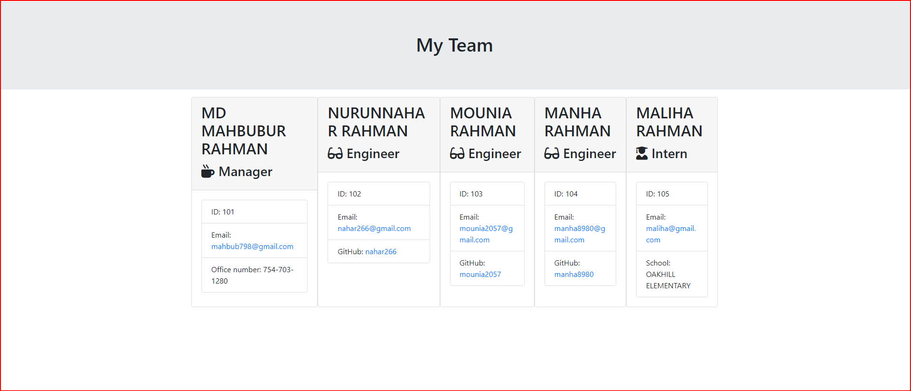

# 10_Team_Profile_Generator_MR

  

  
  ## Description:
  
  One of the most important aspects of programming is writing code that is readable, reliable, and maintainable. Oftentimes, *how* we design our code is just as important as the code itself. In this assignment, my challenge is to build a Node CLI that takes in information about employees and generates an HTML webpage that displays summaries for each person. Since testing is a key piece in making code maintainable, I will also be ensuring that all unit tests pass.
  
  ## Table of Contents:
  
  * [Installation](#installation)
  * [Usage](#usage)
  * [License](#license)
  * [Contributors](#contributors)
  * [Tests](#tests)
  * [Questions](#questions)
  * [Mock-Up](#mock-up)
    
  ## Installation
  
  The following necessary dependencies must be installed to run the application properly: Run "npm i" or "npm install"
  
  ## Usage 
  
  This application is used for generate Team profile. Run "node app.js" to prompt questions.
  
  ## License
  
  This project is license under the MIT License license.
  
  ## Contributors
  1 Contributor - Mahbub
  
  ## Tests
  
  To run tests, you need to run the following command: npm run test

  # Questions

  If you have any questions about the repo, open an issue or contact mahbub798 directly mahbub798@gmail.com.

  ## Mock-Up

The following image demonstrates how the application looks like:

